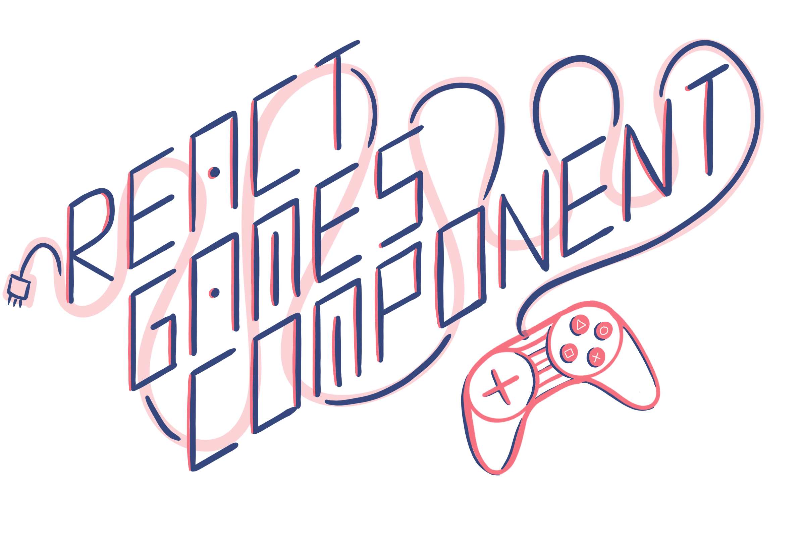

**Link**: [https://react-games-component.netlify.com](https://react-games-component.netlify.com)

## Motivation

**React-games-components** is a component library that helps developers focus on making games by providing all redundant components used in almost all the games.

These game components includes screens(main-menu, game-screen, pause-screen, game-over), scores, characters etc. that are basic requirements for almost all the games. This library is intended to power yet another component library **react-games**, which will have games made using this library's component. Games present in react-games can be added by developers on their personal websites, 404 pages etc.

## Getting started

1.  `npm start` To run the app in the development mode . Browse to [http://localhost:4000](http://localhost:4000) to view it in the browser. The page will reload if you make edits. You will also see any lint errors in the console.

2.  `npm test` Launches the test runner in the watch mode. It will run the following -
    a) unit tests - For actions, reducers and utils using jest.
    b) snapshot tests - For structural testing components using storyshot addon of storybook.

3.  `npm run build` Builds the app for production to the `build` folder.

4.  `npm run storybook` To start the storybook development server.

## Contributing

1. Fork the repo.
2. Clone the repo then `cd react-games-components`
3. Create a new branch.
4. Then `npm install && npm start`
5. Make changes and `git add` files.
6. Run `npm run commit` to create structured commits.
7. Create a PR to master.
